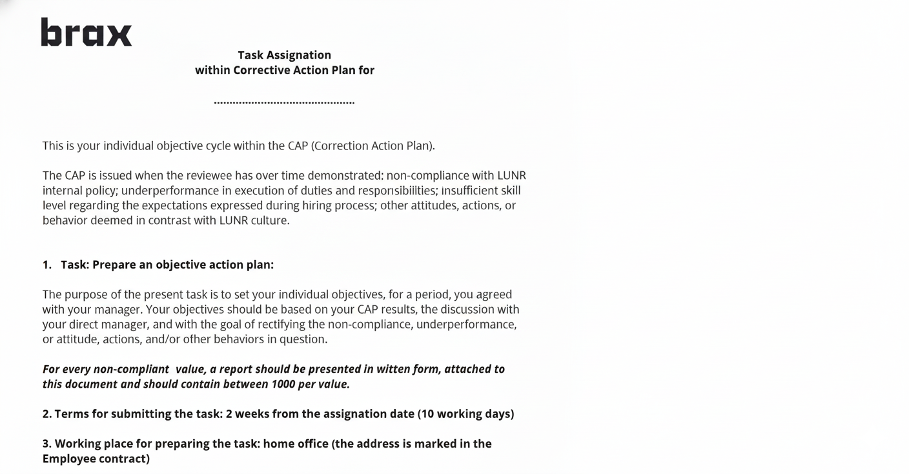

# 🛑 Corrective Action Plan (CAP)

  <h2 style="color: white; margin: 0 0 .5rem 0;">Helping people realign with our mission and culture</h2>
  
When performance or behavior doesn't meet expectations, we provide structured support to get back on track—not punishment, but a path forward.

---

## 🎯 What Is a CAP?

  

    A <strong>Corrective Action Plan (CAP)</strong> is a structured process we use when an employee's performance or behavior doesn't align with our values or expectations. It's not about blame—it's about <strong>clarity, accountability, and support</strong>.
  

Even though we strive to hire dedicated and reliable people, we recognize that sometimes individuals can lose focus on our mission. Life happens. Challenges arise. Priorities shift. The CAP exists to help re-establish the connection between individual actions and our collective goals.

<figure><figcaption>Task Assignation within Corrective Action Plan</figcaption></figure>

---

## 🔍 When Is a CAP Used?

A CAP is typically initiated when:

  <h4 style="color: #c62828; margin-top: 0;">🚩 Performance Issues</h4>
  

    Work quality, productivity, or output consistently falls below the expected standards for your role and level.
  

  <h4 style="color: #e65100; margin-top: 0;">⚠️ Behavioral Concerns</h4>
  

    Actions or attitudes that conflict with our culture code, values, or team collaboration expectations.
  

  <h4 style="color: #283593; margin-top: 0;">📉 Repeated Feedback</h4>
  

    Prior informal feedback or coaching hasn't resulted in meaningful improvement, and a formal plan is needed.
  

---

## 🛤️ How the CAP Process Works

  <h3 style="color: #2e7d32; margin-top: 0;">Our Philosophy</h3>
  

    The CAP is not punitive. It's a <strong>collaborative process</strong> designed to give employees a clear opportunity to realign with expectations, with full support from their manager and People Operations.
  

### 📝 Step 1: Identify the Issue

Your manager will meet with you to discuss specific concerns. This includes:

- **What** is not meeting expectations (behavior, performance, output)
- **Why** it matters (impact on team, mission, or culture)
- **Evidence** or examples demonstrating the concern

### 🎯 Step 2: Define Success Criteria

Together, you and your manager will establish:

- **Clear, measurable goals** for improvement
- **Timeline** for demonstrating progress (typically 30-90 days)
- **Support and resources** you'll receive (training, mentorship, adjustments)

### ✏️ Step 3: Create the Action Plan

You'll work with your manager to draft a written plan that outlines:

- Specific actions you'll take to improve
- Milestones and checkpoints
- How progress will be measured
- Support your manager or the company will provide

### 🔄 Step 4: Regular Check-Ins

Throughout the CAP period:

- Weekly or bi-weekly 1:1s to review progress
- Adjustments to the plan if circumstances change
- Ongoing feedback and coaching

### ✅ Step 5: Final Review

At the end of the CAP period, you and your manager will assess:

- **Success:** Goals met, CAP is closed, normal performance expectations resume
- **Progress but not complete:** CAP may be extended with revised goals
- **No improvement:** Further action, including termination, may be necessary

---

## 🤝 What Support Will You Get?

  <h4 style="color: #667eea; margin-top: 0;">💬 Clear Communication</h4>
  

    Transparent expectations and regular feedback throughout the process.
  

  <h4 style="color: #764ba2; margin-top: 0;">🎯 Resources & Training</h4>
  

    Access to tools, courses, or coaching to address skill or knowledge gaps.
  

  <h4 style="color: #667eea; margin-top: 0;">👥 Manager Partnership</h4>
  

    Your manager is committed to helping you succeed, not set you up to fail.
  

  <h4 style="color: #764ba2; margin-top: 0;">🛡️ People Ops Guidance</h4>
  

    People Operations can provide additional support and ensure fairness.
  

---

## ❓ Frequently Asked Questions

### Does a CAP mean I'm getting fired?

No. A CAP is an opportunity to improve, not a termination notice. Many employees successfully complete CAPs and continue to thrive at Brax. However, if meaningful improvement doesn't occur, termination may become necessary.

### Can I appeal a CAP?

If you believe the CAP is unjust or based on inaccurate information, you can discuss your concerns with People Operations. We take fairness seriously.

### How long does a CAP last?

Typically 30-90 days, depending on the nature of the concerns and the complexity of the improvement needed. The timeline will be clearly stated in your action plan.

### What if I disagree with the feedback?

Open communication is critical. Discuss your perspective with your manager. If you still disagree, escalate to People Operations for review.

---

## 🌟 Our Commitment to You

  

    The current digital landscape is full of challenges, and we're building a future where digital privacy is in users' own hands. <strong>We need the right people to support us on this journey.</strong> Brax is a demanding workplace, but also one that allows you to express your greatness, work the way you perform best, and push you to your limits.
  

  

    When things aren't working, we believe in giving people a fair chance to course-correct. That's what the CAP is about: <strong>accountability with support, clarity with compassion.</strong>
  

---

**Questions about the CAP process?** Reach out to your manager or People Operations.
